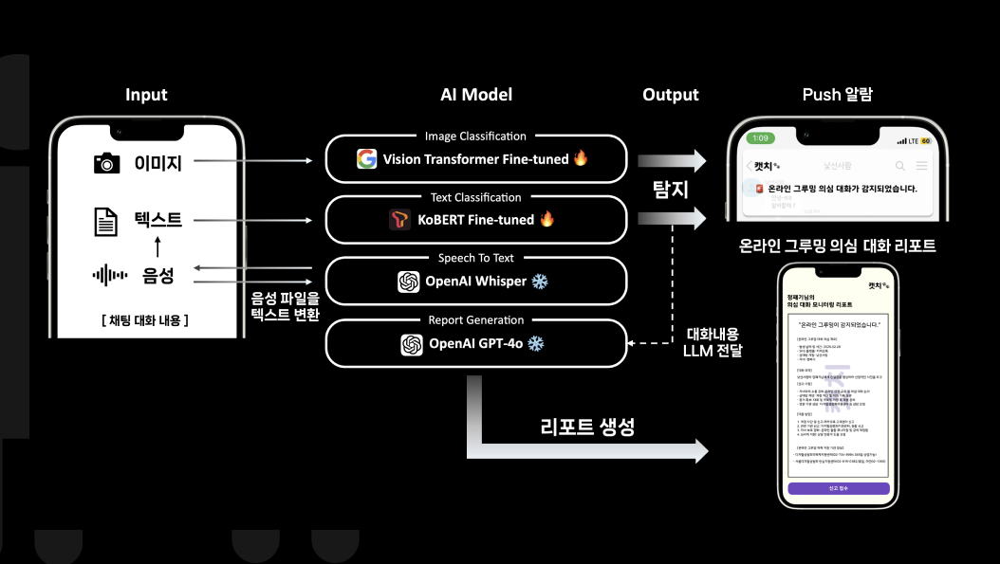

# 🐾 캣치 - 온라인 그루밍 방지를 위한 실시간 AI 서비스

  - **SKT FLY AI 6기** 패기 2팀 (K-CAT)

  - 🏆 SKT FLY AI 6기 **프로젝트 부문 대상**

---

## 📝 프로젝트 소개
 **캣치(CATCH)** 는 인공지능 기술을 활용해 부모와 자녀가 함께 사용할 수 있는 이원화 모바일 앱으로,
자녀의 채팅 앱 내 텍스트, 이미지, 음성 데이터를 실시간 분석하여 온라인 그루밍 위험을 탐지하고,
이상이 감지되면 자녀와 부모에게 즉시 경고 알림을 전송합니다.
백그라운드에서 지속적으로 작동하며, 탐지된 내용은 대형 언어 모델(LLM)을 활용해 자동으로 리포트를 생성하고,
부모가 확인할 수 있도록 시각화하여 제공합니다.

 텍스트 탐지에는 KoBERT 기반 모델, 이미지 분석에는 Vision Transformer(ViT)를 활용하였으며,
온라인 그루밍 특화 성능 강화를 위해 자체 구축한 데이터셋으로 커스텀 파인튜닝을 수행했습니다.

---

## 📱 주요 기능

**💬 채팅 텍스트, 이미지, 음성 감지 시스템**  
  - 자녀가 사용하는 채팅 앱의 텍스트, 이미지, 음성 데이터를 실시간 수집 및 분석
  - AI 기반 필터링으로 온라인 그루밍(성적 접근, 유도, 위협 등)의 징후를 탐지

**🚨 Push 알람 시스템**  
  - 위험 상황 탐지 시, 자녀와 부모의 스마트폰에 즉시 경고 알림 전송
  - 자녀 보호를 위한 빠른 대응 유도

**📄 온라인 그루밍 의심 보고서**  
  - 탐지된 위험 내용을 기반으로, LLM을 활용해 요약 보고서 자동 생성
  - 부모 앱에서 이상 징후 내용, 시점, 유형을 시각화된 형태로 제공
 
**📞 긴급 전화 연결 제공**
  - 청소년 상담 전화(1388) 등 공식 기관과의 빠른 연결 지원

---

## 👷🏾 서비스 아키텍쳐

## 🎥 백그라운드 실시간 감지 데모

  
  

## 🚧 시스템 아키텍쳐

---

## 😼 구성원 소개  
